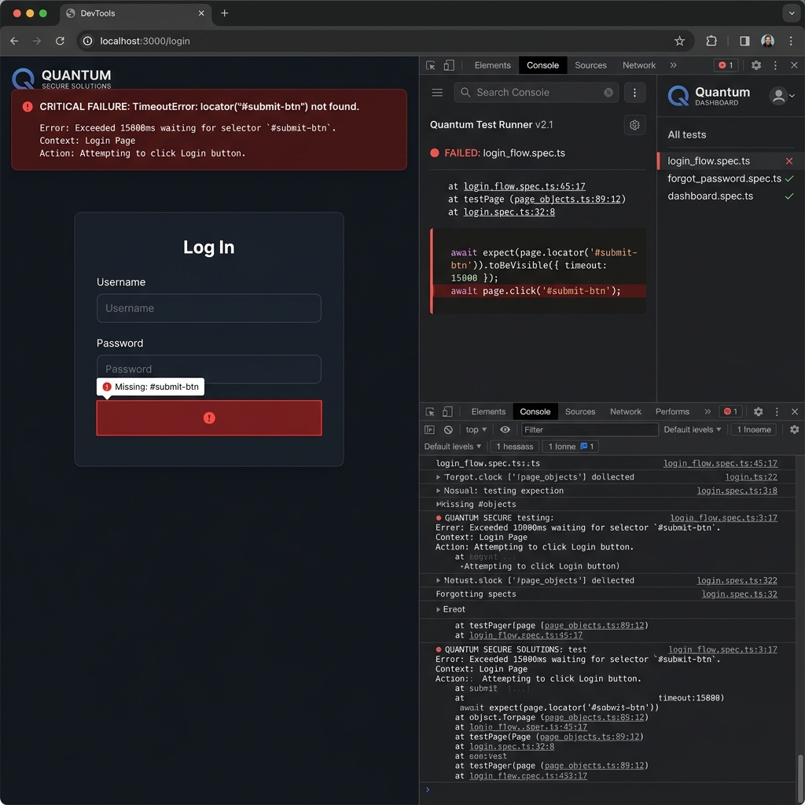

# ⚡ AutoQA-Agent: Autonomous AI-Powered Test Generator & Self-Healing QA Suite

AutoQA-Agent is an autonomous, AI-driven UI test automation and self-healing engine built using **Python, Playwright, Claude 3.5**, and **Streamlit**. It runs automated test suites, intercepts timeout and selector failures, invokes generative AI to heal the selectors by analyzing DOM snapshots, patches the test code files automatically, and verifies the patch in a second run.

---



---

## 🚀 Key Features

*   **Playwright Test Execution**: Automates browser actions (chromium/firefox/webkit) cleanly with zero manual scripting overhead.
*   **AI-Powered Self-Healing**: Automatically intercepts locator timeouts, captures visual/DOM snapshots at failure, and uses **Claude 3.5 Sonnet** (or a local simulation backup) to fix the selectors.
*   **Dual-Script Dashboard Control**: Telemetry control panel to run and test multiple scripts:
    *   `test_sample_login.py` (Mock Login Console)
    *   `test_intuit_assist_mock.py` (Mock Intuit Assist AI Assistant Console)
*   **Futuristic Telemetry Console**: Cyber-Glassmorphism dark theme using custom CSS, glowing status badges, real-time logs, code diff renderers, and scrollable code viewers.
*   **Zero-dependency Testing Sandbox**: Automatically spins up local mock HTML servers to demonstrate automation healing end-to-end.

---

## 🛠️ Tech Stack & Libraries

*   **Frontend**: Streamlit (Futuristic Custom CSS Layout)
*   **Automation Framework**: Playwright, Pytest-Playwright
*   **AI Agent**: Anthropic Claude 3.5 API
*   **Core Logic**: Python 3.11+, Pillow (Pillow Image handling)

---

## 📂 Directory Structure

```text
autoqa-agent/
├── .env                       # API Credentials (Anthropic Key)
├── requirements.txt           # Python dependencies
├── .gitignore                 # Excluded directories
├── app.py                     # Streamlit frontend console
├── test_runner.py             # Telemetry logging & Pytest orchestration
├── self_healer.py             # LLM selector healing & python script patching
├── assets/                    # Graphic assets (Readme illustrations)
│   └── failure_snapshot.png
├── sandbox/                   # Sandbox execution log storage
│   ├── failure_snapshot.png
│   └── test_run_log.json
└── tests/                     # Target Playwright Test scripts
    ├── test_sample_login.py
    └── test_intuit_assist_mock.py
```

---

## 💻 Setup & Run Instructions

### 1. Clone the repository
```bash
git clone https://github.com/rafiaminhaj/autoqa-agent.git
cd autoqa-agent
```

### 2. Install dependencies
```bash
pip install -r requirements.txt
playwright install
```

### 3. Setup credentials
Create a `.env` file in the root folder:
```text
ANTHROPIC_API_KEY=your_claude_api_key_here
```
*(Note: If no key is supplied, the agent automatically switches to **Simulation Mode** to demonstrate the self-healing and code-patching process for recruiters without incurring costs!)*

### 4. Launch the dashboard
```bash
streamlit run app.py
```
Open `http://localhost:8501` in your browser.

---

## 🔮 Future Enhancements
*   Add full **Model Context Protocol (MCP)** server bindings.
*   Add multi-browser testing grids on GCloud Run.
*   Add GitHub webhook alerts to trigger heals directly on failed PRs.

---
Created with ❤️ by [Rafia Minhaj](https://github.com/rafiaminhaj)
